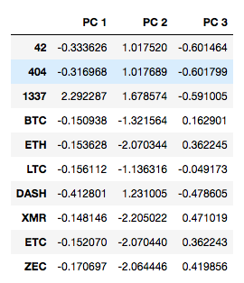
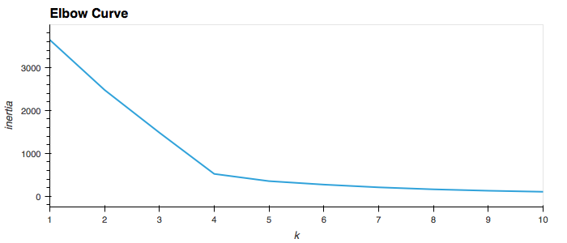

# Cryptocurrencies

The purpose of [**Module 2**](https://trilogyed.instructure.com/courses/626/pages/2-dot-0-1-using-unsupervised-learning-to-discover-unknown-patterns?module_item_id=32057) is to use unsupervised machine learning algorithms to create a report that includes what cryptocurrencies are on the trading market and how they can be grouped to create a classification system for this new investment vehicle.

## Analysis

The analysis is divided into **4** distinct phases (highligthed below).

1. Deliverable 1: Preprocessing the Data for PCA (30 points)
2. Deliverable 2: Reducing Data Dimensions Using PCA (20 points)
3. Deliverable 3: Clustering Cryptocurrencies Using K-means (30 points)
~4. Deliverable 4: Visualizing Cryptocurrencies Results (30 points)~

### Deliverable 1: Preprocessing the Data for PCA (30 points)

To preprocess the data in preparation for the subsequent analysis, the data was

#### Preliminary preprocessing

1. Loaded to the `crypto_df` [Pandas](https://pandas.pydata.org) [DataFrame](https://pandas.pydata.org/pandas-docs/stable/user_guide/dsintro.html#dataframe)
2. All cryptocurrencies with `IsTrade` equal to `True` are retained
3. All cryptocurrencies that have a working algorithm

> **code**
>
> ```python
> crypto_df['Algorithm'].replace('', np.nan, inplace=True)
> crypto_df.dropna(subset=['Algorithm'], inplace=True)
> ```

4. The `IsTrading` column is dropped
5. All rows with *at least* 1 null value is removed
6. Finally, all rows with *at least* 1 mined coin is retained

#### Handling categorical data and standardization

Since the name of the crytocurrency is not relevant in the analysis, it was removed to it's own DataFrame and dropped from the `crypto_df`.

> **code**
>
> `cryptoname_df = crypto_df[['CoinName']]` and `crypto_df = crypto_df.drop(columns=['CoinName'])`

The `object` labels (i.e columns with `object`) where then encoded with Pandas `get_dummies` function and finally, the features were standardized using the `StandardScaler()`.

### Deliverable 2: Reducing Data Dimensions Using PCA (20 points)

The dimensions of the standardized features DataFrame, `X_scaled`, were reduced using Principal Component Analysis (PCA) to three principal components.



### Deliverable 3: Clustering Cryptocurrencies Using K-means (30 points)

To find the value for `k` to optimally cluster the dataset, the elbow curve was utilized.



## Results

### Deliverable 4: Visualizing Cryptocurrencies Results (30 points)

## Summary